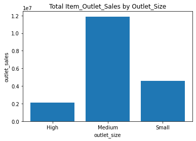
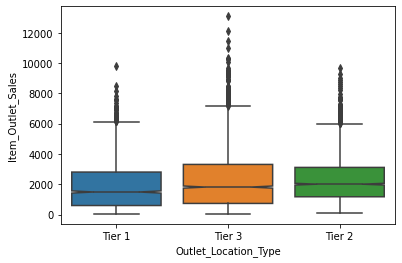

# Sales_prediction
## The project is about designing the model that predicts the sales of food at different stores using different parameters. 

**Author**: LAMUNU GLORIA

### Business problem:
To predict the item_outlet_sales based on the different data collected from the stores

### Data:
Item_Outlet_Sales, Item_Weight, Item_Fat_Content, Item_Visibility, Item_Type, Item_MRP, Outlet_Identifier, Outlet_Establishment_Year,
Outlet_Size, Outlet_Location_Type, Outlet_Type, Item_Outlet_Sales

## Methods
- Importing libraries and loaded the data
- Exploring the data, using data visualization like heatmaps: to identify the correlation between different columns, histograms and boxplots to compare data
- Ordinal Encoding the data becasue Item_Fat_Content,Outlet_Location_Type,Outlet_Size is ordinal
- Performing train_test_splitting the data. The X is the feature matrix and is represented by the Item_Outlet_Sales. For the target 'y', the columns Item_Identifier, Item_Visibility,Outlet_Identifier,Item_Outlet_Sales were dropped
- Instantiating column selectors for numerical data and categorical data because some data was of the object type and the rest numerical
- Instantiating transformers StandardScaler and One Hot Encoder . One hot encoding is done because the column Item_Type is norminal
- Instantiating pipelines for numerical data and categorical data
- Fitting data on a preprocessor
- Instantiating the linear regression model  and evaluating the model with R^2 score and Root Mean Squared Error
- Instantiating the DecisionTreeRegression model and evaluating the model with R^2 score and Root Mean Squared Error
- Fine tuning the DecesionTreeRegression using the different depths and finding the depth that provides the highest R^2 score

## Results

### Here are examples of how to embed images from your sub-folder

#### Item_Outlet_Sales Versus Outlet_Size

> The highest sales is seen in the Medium then small and least in the high outlet_size

#### Boxplots showing relationship of Item_Outlet_Sales and Outlet_Location_Type

>There are very many outlier values affecting the distribution of sales. Teir 1 has median of 1500 in sales, teir 2 has median of sales with 2000 in sales and teir 3 with 1900 in sales. When you look at the ranges and interquartile ranges, Teir 1 and Teir 2 have lower values than Teir 3. All the locations are skewed positvely All the locations have multple outliers with teir 3 having the highest. Overall teir 3 has the most sales because of its spread and the concentration of outliers

## Model

I chose the linear regression model because I achieved an R^2 score  was 0.4998900106557477 on Model training and 0.5009230284932022 on model testing. The Root mean squared error(RMSE) for the model on training data is 1216.5744370385087 and that of testing data set is 1173.431731825326. The R^2 value indicates that the model is explaining 50% of the variation in Item_Outlet_Sales. The RMSE value for the testing data shows that our model is off by 1173.4317. Nevertheless, the RMSE was lower on the testing data than on the traing data suggesting the model is generalizing the data well

## Recommendations:

I recommend trying out different models such as bagged trees and random forest regression models to improve my model

## Limitations & Next Steps

M

### For further information

For any additional questions, please contact **email**
